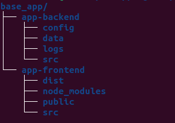

# Deployment

Follow the tips to deploy this app:

- Choose a location and create a directory with the project name
- Place into the directory and proceed:

  `git clone https://gitlab.siacloud.es/solutions/app-front.git`

  `git clone https://gitlab.siacloud.es/solutions/app-backend.git`

    Folder structure will look as the following picture:

    

## Backend

- Create a virtual environment through virtualenv, or any 3rd tool, as Virtualenvwrapper (recommended)
  
  `mkvirtualenv -p python3.11 env_name`

- Install required packages to deploy
  
  `pip install -r requirements-dev.txt`

- To run the application in local environment

  `python src/manage.py runserver`

### Test on docker

`docker compose -p myapp -f docker-compose-local.yml up --build`

## Frontend

- To install required packages:
  
  `npm install` 

- To run the application
  
  `npm run dev`
  